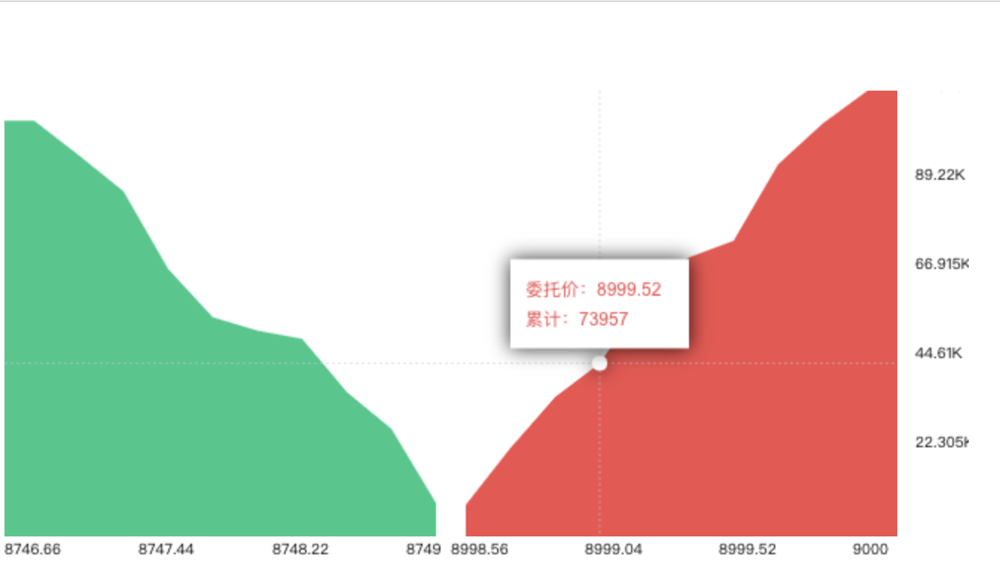

# vue深度图组件
常用于股市、虚拟货币等交易所使用

# 示意图

# 使用方式
## 1. 安装
` npm i v-depth-chart `
## 2. 引用
``` javascript
import VdepthChart from 'v-depth-chart'
// 全局引用
Vue.use(VdepthChart)
```
## 3.调用

```html
<v-depth-chart :data="data"></v-depth-chart>
```

# 开发模式
` npm run serve `
# 打包
` npm run build `